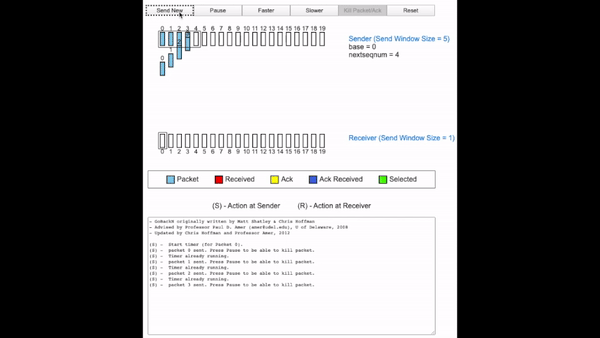

### Continuação: *Transport Layer*

Como citado na aula anterior, o protocolo *stop and wait*, no qual o envio do próximo segmento (também é chamado de pacote por uma questão histórica) ocorre somente após o recebimento da resposta do segmento anterior, é uma forma ineficiente para a transferência de dados confiáveis (*reliable data transfer*, rdt) pois, após a transmissão de um segmento, os recursos disponíveis para a conexão ficarão osciosos até a chegada da resposta do segmento enviado. Dessa maneira, objetivando o aumento da eficiência do mesmo, fora propostos duas soluções: *Go-Back-N* (bgn); e *selective repeat* 

#### GO-BACK-N

A ideia do protocolo gbn é basear-se em um subconjunto de N elementos da fila de transmissão (um dos motivos para a imposição de um tamanho limite é o controle de fluxo). Os elementos dessa fila são compostos por espaços que podem ser preenchidos por segmentos oriundo das camadas superiores. Esse subconjunto, chamado de janela, contém os espaços preenchidos por segmentos enviados mas sem confirmação (*acknowledged*) e espaços ainda não preenchidos. Ao receber uma resposta, o espaço relacionado ao respectivo segmentos sai da janela, um novo elemento da fila de transmissão é adicionado, gerando o efeito de deslizar da janela para a direita na fila de transmissão, devido a esse efeito o gbn é chamado de *sliding-window protocol*. 

Caso todos os espaços disponibilizados pela janela estejam preenchidos, novos dados não poderão ser aceitos, retornando ás camadas superiores, sendo esse retorno uma indicação de indisponibilidade.

Na metade superior da Animação 01 pode ser identificado os parâmetros: `base`, que identifica o valor inicial incluido; `nextseqnum`, referente ao próximo elemento a ser enviado; e `send window size`, tamanho da janela (valor do N supracitado). A metade inferior mostra o registro dos eventos ocorridos durante o protocolo. 

Animação 01: Animação Go-Back-N\


Disponível em: https://media.pearsoncmg.com/aw/ecs_kurose_compnetwork_7/cw/content/interactiveanimations/go-back-n-protocol/index.html


Como o envio dos segmentos é feito em ordem, é esperado que os respectivos ACK's sejam recebidos em ordem (*cumulative acknowledgment*). Caso o *server* receba um segmento corrompido ou fora de ordem, o mesmo é descartado e um ACK referente ao último segmento íntegro ordenado é disparado. O ACK duplicado recebido é descartado. Da perspectiva do *client*, a não recepção ACK correspondete ao segmento enviado, pode resultar em dois casos. Primeiro, se a recepção do ACK 'x + 1' ocorrer, porém a do 'x' não, o gbn considerará que o segmento 'x' foi recebido corretamente pelo *server* e o seu ACK fora perdido durante a transmissão, marcando, portanto, o segmento 'x' como enviado corretamente. O segundo caso é a respeito da não recepção de respostas dentro de um período predeterminado (*timeout*), algo que resulta na retransmissão dos segmentos relativos.

Exemplo 1:

1. *cliente* dispara 5 segmentos (1, 2, 3, 4, 5)
2. *server* recebe o segmento número 2 corrompido
3. *server* dispara os seguintes ACK's: 1, 1, 1, 1, 1
4. *cliente* recebe 5 ACK's referentes ao segmento 1, indicando a necessidade de retransmissão dos segmentos 2, 3, 4 e 5.

Exemplo 2:

1. *client* dispara 5 segmentos (1, 2, 3, 4, 5)
2. *server* recebe todos os segmentos corretamente
3. *server* dispara os seguintes ACK's: 1, 2, 3, 4, 5
4. *client* somente o ACK número 5, tendo, o resto, sido perdido durante a transmissão.
5. *client* qualifica todos os 5 segmentos como tendo sido recebidos corretamente pelo *server*


#### Selective Repeat (SR)

É importante perceber, como mostrado no Exemplo 1, que um único elemento corrompido pode causar a retransmissão de uma série de segmentos, tornando, assim, o gbn ineficiente para esses casos. O aumento dessa ineficiência é diretamente proporcional ao número de erros provocados pelo canal de transmissão.


O protocolo *Selective Repeat* (SR), como o próprio nome já induz, tem o objetivo de diminuir o número de retransmissões desnecessárias. Para tal, utiliza um subconjunto de N elementos da fila de transmissão, chamada de janela, com cada elemento sendo um espaço que pode ser preenchido por um segmento e marcado como não usável, usável, enviado e confirmado, algo análogo ao gbn. Porém, diferencia-se pelo seu comportamento. 

1. um elemento só é marcado como confirmado quando o mesmo receber seu respectivo ACK. 
2. a janela desloca-se somente após o recebimento do ACK relativo ao elemento na posição `base`, localizado no início da janela. 
3. o *server* enviará um ACK para cada segmento mesmo se ele estiver fora de ordem. 
4. o *client* terá uma janela própria (do mesmo tamanho da janela do *client*), organizando-a, também, com 4 marcadores: esperado; fora de ordem; aceitado; não usável. 
5. um segmento recebido fora de ordem não será descartado e sim armazenado em uma memória temporária (*buffer*).

Esse comportamento gera uma possível desincronização da posição das janelas do *cliente* e do *server*, pois o *server* pode receber adequadamente um segmento mas o seu ACK relativo ter sido corrompido ou perdido durante a transmissão. O pior caso de desincronização ocorre quando todos os ACK's enviados tenham sido perdidos e, consequentemente, o *server* estará adiantado em `N` elementos. Assim, caso o *server* receba um segmento com o número da sequência entre entre os intervalos:

1. [`base`, `base` + `N` - 1]: armazenar em memória temporária.
2. [`base`-N, `base` - 1]: reenviar o ACK.
3. Fora dos anteriores: ignorar.

A desincronização pode causar a recepção de um segmento já recebido, gerando um dilema para o receptor: o segmento recebido é novo ou é uma retransmissão ?

Essa possível desincronização pode causar um dilema para o receptor dos dados, pois, como mostrado na 
A Figura 01 mostra o dilema ocasionado pela possível dessincronização:  os dados recebidos são derivados de uma retransmissão, como mostrado em (a), ou de um novo segmento (b)? 

Figura 01: Dilema do Selective Repeat\

Imagem retirada de: Computer Networking a top-down approach. 8th ed. Pearson, página 225.


Colocações importantes:

1. O número de sequência é um valor finito determinado pelo número de bits disponibilizados para tal.
2. O *buffer* do receptor deve poder armazenar 2 janelas, ou seja, o seu tamanho deve ser, no mínimo, o dobro do `window size` (`N`).
3. O `N` é determinado durante o *handshaking*, limitado pelo tamanho do *buffer* do receptor (como citado em 2).


#### TCP

A camada de aplicação (*application layer*), para o envio de um arquivo, conta com os serviços de transmissão de dados confiáveis fornecidos pelo *Transmission Control Protocol* (TCP), protocolo da camada de transporte. O TCP, ao receber o arquivo oriundo da *application layer*, divide-o em pedaços de comprimentos iguais chamados de *chunk's of data* (com exceção do último, normalmente menor), de tamanho igual ao MSS (*maximum segment size*), normalmente de 1460 *bytes*. O encapsulamento de um *chunk of data*, etapa que une o mesmo com o *header* do TCP, resulta em um conjunto de dados chamado de segmento.  

O parâmetro MSS é determinado pelo MTU (*Maximum Trasmission Unit*), tamanho máximo do *frame* da camada de enlace (*link-layer*), que tem como objetivo garantir que o segmento TCP somado com o *header* do TCP/IP (tipicamente 40 bytes), caberá no *frame* do *link-layer*.

Após sua formação, o segmento é inserido no *send buffer*, memória temporária destinada ao envio dos dados para as camadas inferiores. Essa memória é acessada de tempos em tempos para o envio dos segmentos ali presentes.

Porém, diferente do UDP, o TCP é um protocolo orientado à conexão (*connection-oriented*), pois o primeiro contato entre dois dispositivos ocorre com base no procedimento *3-way handshake*, o qual visa assegurar à confiabilidade na transmissão dos dados a partir da definição dos parâmetros da conexão. 
O *3-way handshake* é caracterizado pela transmissão de 3 segmentos especiais. O primeiro é emitido pelo *client* visando o início da conexão. O segundo é uma resposta do *server*, indicando que o segmento foi recebido corretamente. Por fim, o *client* confirma que também recebeu o segmento oriundo do *server*. Os dois primeiros segmentos especiais não contém dados, mas o terceiro pode conter.


A seguir está listado as características principais do TCP (mencionado em aulas anteriores):

1. Ponto-a-ponto
2. Transmissão de confiança, com fluxo de dados ordenado
3. *Full Duplex*: fluxo de dados bi-direcional na mesma conxeção
4. *cumulative* ACK's
5. *Pipelining*: controle de fluxo e congestionamento
6. *Connection-oriented*
7. Fluxo controlado: o emissor não irá sobrecarregar o receptor


##### Estrutura do segmento TCP

Como citado anteriormente, o segmento do TCP é composto por seu *header* e pelo pedaço do dado enviado pela camada de aplicação.
O *header* é a sessão do segmento responsável pelos parâmentros de conexão. São eles:

1. números das portas de origem e destino, utilizados na multiplexação e demultiplexação, respectivamente.
2. *checksum field*, importante na validação da integralidade dos dados recebidos
3. 32-bit *sequence number field*
4. 32-bit *acknowledgment number field*
5. 16-bit *receiver window*: usado para *flow control*, indica o número de bytes que o receptor está disposto a aceitar 
6. 4-bit *header length field*: especifica o tamanho do *header* do TCP (como, normalmente, o *options field* não é populado, o tamanho típico do *header* é de 20 *bytes*)
7. *options field*: é útil para a negociação do MSS entre outros.
8. *flag field*: campo que contém 6 bits
8.1. bit ACK: indica a validade do campo ACK
8.2. bits RST, SYN e FIN: são usados para configuração das conexões
8.3. bits CWR e ECE: notificações de congestionamento
8.4. bit PSH: indica que o receptor deve repassar, de imediato, os dados recebidos para as camadas superiores
8.5. bit URG: marcado pela camada de aplicação do emissor, indica que há dados urgentes
(Na prática, os bits PSH e URG não são usados)

A Figura 02 mostra toda a estrutura do segmento TCP.

Figura 02: Estrutura do segmento TCP\
\
Imagem retirada de: Computer Networking a top-down approach. 8th ed. Pearson, página 231.

#### Sequência e ACK


O TCP vê os dados como um conjunto ordenado e não estruturado de fluxo (*stream*) de bytes, de forma que o *sequence number* é uma referência à ordem dos bytes (mais especificamente, a ordem do primeiro *byte* dos dados do segmento) e não da série de segmentos enviados. Assim, para um arquivo de 500.000 *bytes* (500 kB) e um MSS de 1.000 bytes (1 kB) serão construidos 500 segmentos, com o primeiro assumindo o *sequence number* de 0, o segundo 1000, o terceiro 2000, e assim em diante.

Já *acknowledgment number* (ACK *number*) é relativo ao *sequence number* do próximo *byte*. Seguindo o exemplo anterior, está contido, no primeiro segmento, 1000 bytes, e o seu *sequence number* é de 0 (marcando o *byte* 0 até 999). Assim, após a chegada no *byte* 999, o receptor enviará a confirmação da recepção desse segmento com o *acknowledgment number* de 1000 (byte seguinte ao último recebido). Dessa maneira, como o receptor só confirma (*acknowledges*) o primeiro byte ausênte, no caso, o byte 1000, o protocolo TCP é dito como provedor de *cumulative acknowledgments*.

A Figura 03 mostra um exemplo de como a variação do *sequence number* e do *acknowledgment number* ocorrem com o MSS de 1 *byte* no Telnet. O *Host A* envia seu *byte* 42 (*sequence number*) requisitando (ACK) o byte de *sequence number* 79 do *Host B*, e o *Host B* responde com o seu *byte* 79 e requisita o *byte* 43 do *Host A*.

Figura 03: *Sequence number* e ACK\
\
Imagem retirada de: Computer Networking a top-down approach. 8th ed. Pearson, página 234.

##### Segmentos fora de ordem

Como citado anteriormente, o tratamento dos segmentos fora de ordem, para um sistema confiável de transferência de dados, pode seguir uma dessas suas estratégias, *GO-BACK-N* ou *Selective Repeat* (SR). Por uma questão de eficiência, o protocolo SR é a abordagem praticada.


#### RTT e Timeout

Após o envio de um segmento, após quanto tempo o TCP deve considerar que os dados foram perdidos (`timeout interval`) ?
Esse tempo sofre de uma dicotomia, pois tanto períodos pequenos como grandes tornam a comunicação ineficiente por causar retransmissões desnecessárias e aumentar o atraso na retransmissão de segmentos perdidos, respectivamente.

Podemos considerar que, no mínimo, o tempo esperado deve superar o *Round-Trip Time* (RTT), período entre o envio de um dado e a chegada de sua resposta. Como pode-se imaginar, por consequência da não previsibilidade de seu uso e da ocorrência de erros, as condições presentes na rede são variáveis (como o congestionamento), algo que impacta diretamente no (RTT), tornando-o, também, variável. 

Assim, a determinação do `timeout interval` passa por um cáculo estatístico, definido pelo `SampleRTT`, uma amostra desse período medida de tempos em tempos, `EstimatedRTT`, uma estimativa do valor do RTT que utiliza a técnica da média móvel exponencialmente ponderada (EWMA, *Exponential Weighted Moving Average*), e `DevRTT`, uma estimativa de quanto o `SampleRTT` desvia do `EstimatedRTT`. Os cálculos podem ser vistos a seguir.


Valor recomendados [RFC 6298]:
α = 0.125 (1/8)
β = 0.25  (1/4)

```
EstimatedRTT = (1 – α) * EstimatedRTT + α * SampleRTT
```

```
DevRTT = (1 – β) * DevRTT + β * | SampleRTT – EstimatedRTT |
```

Para questões de eficiência, é interessante manter o valor do *timeout interval* algo como o valor estimado do RTT (`EstimatedRTT`) mais uma margem que se adeque à flutuação de valor do `SampleRTT` (`DevRTT`). Dessa maneira, chegamos do cálculo a seguir (sendo 1 segundo o valor inicial):

```
TimeoutInterval = EstimatedRTT + 4 * DevRTT
```

#### Flow Control


#### Adicionais

1. Flow Control (Computer Networking a top-down approach. 8th ed. Pearson, página 246)
2. TCP Connection Management (Computer Networking a top-down approach. 8th ed. Pearson, página 249)
3. Congestion Control (Computer Networking a top-down approach. 8th ed. Pearson, página 255)
4. TCP Congestion Control (Computer Networking a top-down approach. 8th ed. Pearson, página 263) (TCP Cubic, Fairness)
5. Evolution of Transport-Layer Functionality (Computer Networking a top-down approach. 8th ed. Pearson, página 279) (QUIC (*Quick UDP Internet Connection*))
