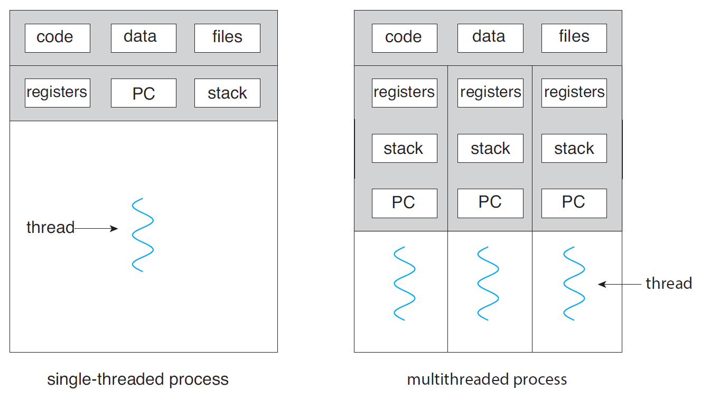

**Processos e threads

***Thread é uma parte do processo

Como dito na aula anterior, um processo é uma entidade ativa a qual se refere à um programa em execução. Porém, a CPU não recebe essa 
entidade na sua integralidade para processamento, e sim uma parte da mesma chamada de Thread. Nessa está contido os elementos necessários para
a mudança de contexto da CPU (*CPU Context Switch*), como os valores dos registradores utilizados, a memória Stack e o PC (Program Counter).
Em sistemas mais antigos (*single-threaded*, ou única *thread* por processo), cada nova tarefa a ser executada deve-se passar pela criação de um novo processo.

****Concurrency vs Parallelism

Uma observação importante é que um programa, em um sistema com um único núcleo de processamento, pode rodar em simultâneo (*concurrency*) com outros, com a alternação do processo a ser executado pela CPU em certos períodos de tempo, porém não em paralelo (parallelism).

*****Concurrency
Os processos são distribuidos para a CPU com a técnica *Round-Robin*, com a qual é gerada uma fila de processos, e a saída de cada fila vai para o processador. Após um certo período de tempo de processamento, esse processo para de ser processado, o seu contexto é salvo, e o mesmo volta para o final da fila. Um novo processo então é carregado, e o contexto da CPU alterando para o relativo ao novo processo. A mudança de contexto da CPU (*CPU context-switch*) é o que torna possível a CPU retormar o processamento do momento de um processo específico no momento que o mesmo foi encerrado.

*** Criação de novos processos

Na linguagem `C`, a criação de um novo processo passa pela função `clone()`, a qual copia, conforme instruções do programador, todos os elementos do processo original
para o novo processo, consumindo, assim, recursos como a memória, com a locação múltipla dos mesmos dados. Uma tentativa de otimização vem na função `fork()`, que utiliza
o conceito de `CoW` (*Copy on Write*, ou cópia na escrita, funcionalidade do sistema de gerenciamento de memória), somente copiando os dados, para o novo endereço de memória, caso haja alteração dos mesmos. Isso é possível com o uso dos ponteiros, discutidos na aula anterior, para a leitura dos dados.
É importante notar que a execução do processo criado continuará a partir da última posição do IP (*Instruction Pointer*, ou ponteiro de instrução), fazendo com que
as instruções escritas antes do `clone()` ou `fork()` nunca sejam lidas.

A função `fork()` retorna:

1. -1, caso tenha falhado;
2. 0, para o processo filho, com o PPID (*Parent Process Identifier*, ou identificador do processo pai)
equivalendo ao PID (*Process Identifier*, ou identificador do processo) do processo pai
4. PID do processo filho, no processo pai. 

*** Porquê devemos criar novos processos ?

Há dois motivos para a criação de novos processos (em sistemas mais antigos):

1. Inicialização de um novo programa, com o `execve()`.
2. Múltiplas tarefas de um mesmo programa.

Apesar da otimização citada na seção anterior (com o `CoW`), o procedimento de criação de um novo processo é custoso de recursos computacionais, sendo o *multi-threading* (múltiplas threads no mesmo processo) uma solução para a criação de múltiplas tarefas com o mesmo programa (caso 2).
Assim, a seguir falaremos da função `execve()` e do multi-threading.

***Execve()

A função `execve()` tem como objetivo alterar a imagem de execução, que está contida no processo, para a do novo programa, isso é, o *Data*, *Heap*, *Stack* e *Text* serão carregados com o conteúdo do novo programa.

***Multi-threading

É importante notar que os sistemas operacionais evoluíram, com os mais antigos limitando-se à *single-threading* (uma *thread* por processo), e os mais novos rompendo essa limitação, passando à *multi-threading* (múltiplas *threads* por processo), como mostrado na Figura 1.

*Figura 1: Single and Multi-Threaded Example*

*Imagem retirada de: Silberschatz, A. Operating System Concepts, 10th, página 160.*

O *multi-threading* trás consigo diversas vantagens, como:

1. Responsividade: Um programa continua rodando mesmo quando uma parte sua é bloqueada, trava ou demora para concluir.
2. Compartilhamento de Recursos: As *Threads* compartilham o mesmo código e dados por padrão.
3. Economia: é mais econômico criar uma *Thread* do que um processo. É mais rápido trocar o contexto da CPU (*CPU context-switch*) entre *Threads* do que entre processos.
4. Escalabilidade: *Threads* podem usufruir do paralelismo, rodando em múltiplas CPU's em simultâneo de forma assíncrona.

