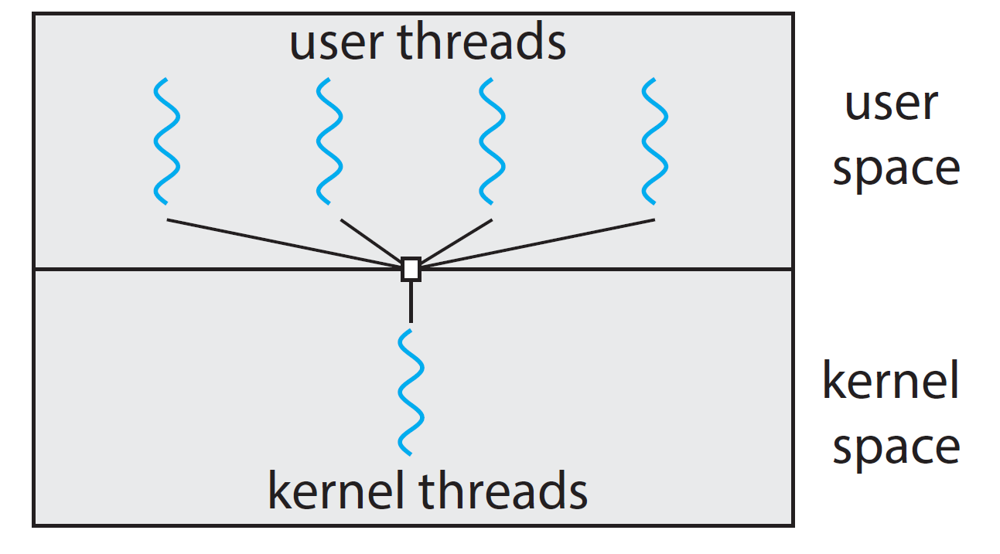
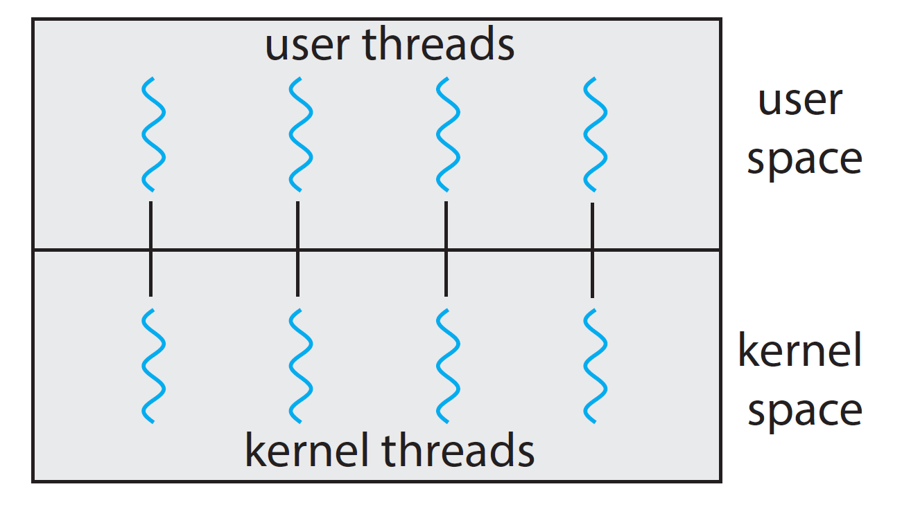
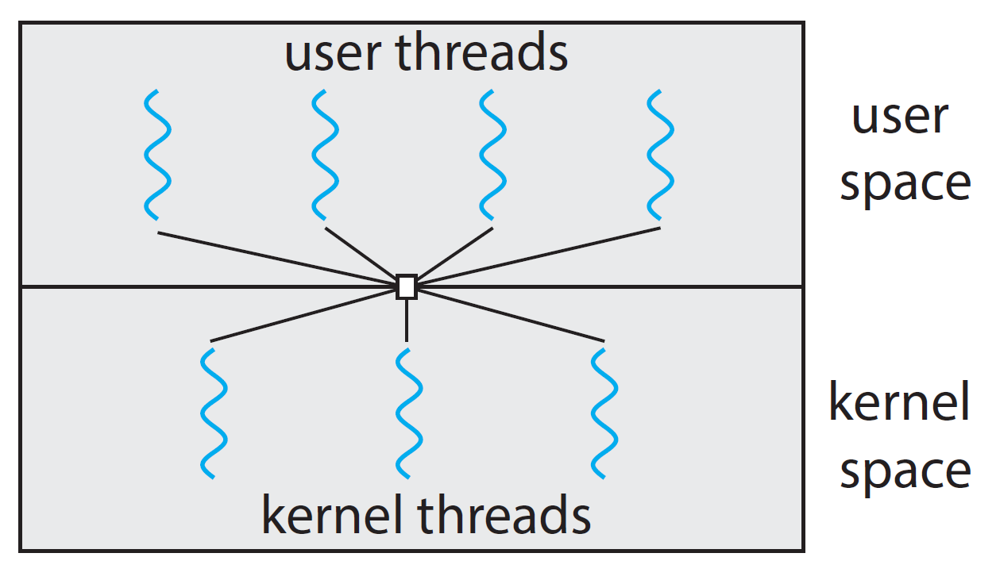
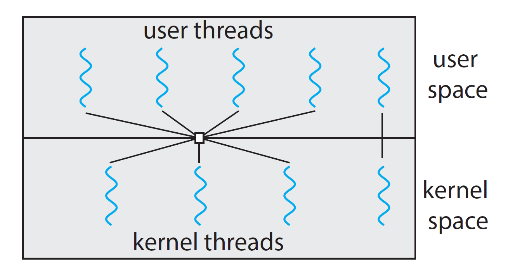

## Introdução.


||
|:--------:|
|<b>Figura 1: Loja de único atendente</b> 
<b>Autor: rawkkim, de: unsplash.com</b>| 

Imagine, caro leitor, que você seja dono de uma loja e que você não tenha funcionários, como na Figura 1. Todas as tarefas, entre administrar o estoque, dar baixa no caixa e atender os clientes, deve ser feito por você. 
Qual estratégia você deve tomar para tornar isso possível ?


A proposta natural é a de seguir uma sequência de passos: inicialmente deve-se chamar o primeiro cliente da fila; atendê-lo; depois administrar o estoque; vender o produto; dar baixa no caixa; repetir o ciclo. 

A vantagem é que todo o processo de venda é concluído antes de iniciar o próximo ciclo. A desvantagem é que os novos clientes terão que esperar bastante tempo para serem atendidos, e a fila de espera pode desanimar possíveis compradores, como na Figura 2. É preciso perceber também que o gargalo desse processo está no atendimento ao cliente, afinal, a escolha do cliente (ou *input* do usuário do processo) não tem um momento determinado para ocorrer. Outro problema é que um travamento (por conta de um problema imprevisto) em uma dessas tarefas impedirá (ou atrasará) que as próximas sejam trabalhadas.


||
|:--------:|
|<b>Figura 2: Fila de espera</b> 
<b>Autor: Levi Jones, de: unsplash.com</b>| 


Para solucionar esse gargalo, poderíamos pensar em alocar, para cada tarefa, uma parcela de tempo, digamos 10 minutos, de forma que, após esgotado esse tempo, você terá que alterar a tarefa a ser executada, independente se a mesma foi concluída ou não, passando para a próxima não interdenpendente (*non-blocking*). Assim, o leitor iniciaria o processo chamando o primeiro da fila. Após 10 minutos, caso o atendimento não seja concluído (por exemplo, o cliente ainda não tenha escolhido o produto que quer), essa tarefa atualmente em trabalho será deixada de lado (entrando no estado de espera), e a próxima tarefa não interdenpendente (que no caso seria chamar o próximo da fila) deverá ser executada. A vantagem dessa abordagem é que o tempo dentro da fila de espera deve cair substancialmente, pois aproveita-se o tempo (no qual, anteriormente, você ficava oscioso) de escolha (de um produto) de um cliente, atendendo o próximo da fila. 

Essa abordagem também trás desvantagens. Primeiro, você terá que administrar (e muito bem) a prioridade e a alternância entre tarefas, aumentando assim a complexidade do ciclo. Os clientes que fazem escolhas rápidas podem não ficar contetes em ter que esperar que outras tarefas relacionadas com outros compradores sejam concluídas (ou que entrem no estado de espera) previamente, ocorrência que diminui o tempo de resposta (responsividade) do processo. Igualmente, um número suficiente de compradores pode tornar a responsividade tão baixa que os clientes, simplesmente, dessistirão do atendimento, derrubando a qualidade percebida e, a loja, deixando de realizar a venda. A imposição de padrões de qualidade (como um tempo máximo de espera por cliente), pode resolver o problema anterior, mas criar outros, como a loja negar a servir mais que uma quantidade específica de pessoas por período de tempo (análogamente, ataque DDoS).

Pode-se pensar também em abrir uma segunda (ou terceira, quarta, etc) loja ao lado, com um colaborador cada, de forma que mais clientes possam ser atendidos. Porém, novos recursos (como caixa, material lampadas, etc) terão que ser adquiridos, demandando tempo e dinheiro para tal.

Então, a solução mais simples (e com diversas vantagens) é a contratação de empregados para que múltiplas tarefas possam ser desempenhadas em paralelo, como mostrado na Figura 3.


||
|:--------:|
|<b>Figura 3: Três trabalhos em paralelo</b> 
<b>Autor: Charlie Firth de: Unsplash</b>| 


A história acima é uma analogia ao que ocorre nos sistemas computacionais modernos, de forma que:

• O processo (em um sistema operacional) é equivalente à loja.
• Funcionários são como *threads*.
• Os recursos da loja (caixa, material lampadas, etc) são como os recursos computacionais (como a memória).
• O ciclo de venda é o serviço oferecido pelo sistema computacional. 
• E assim em diante.


Essa comparação é interessante pois a mesma pergunta vem à tona: devemos criar um novo processo (abrir uma nova loja) ou, simplesmente, criar novas *threads* (contratar colaboradores) ?

O capítulo atual foi dividido em:

• Identificar os componentes de uma *thread*.
• Benefícios e desafios.
• *Threads* e o Linux. (descrever como as *threads* são representadas no Linux e projetar uma aplicação).
• Complementar


### Identificar os componentes de uma *thread*.

A *Thread* (unidade de processamento do processo) é composto pela *thread id* (seu identificador único), PC (*program counter*), valores dos registradores, memória *stack*. Ela compartilha, com outras *theads* do mesmo processo, recursos como as sessões de memória *text*, *data* e os arquivos abertos, como mostrado na Figura 4.


||
|:--------:|
|<b>Figura 4: Processos com uma ou múltiplas threads</b> 
<b>Imagem retirada de: Silberschatz, A. Operating System Concepts, 10th, página 160.</b>|


### Benefícios e Desafios.
#### Benefícios.

Em sistemas com múltiplos núcleos de processamento, as *threads* podem trazer várias vantagens, como:

 
1.Responsividade: Um programa continua rodando mesmo quando uma parte sua é bloqueada, trava ou demora para concluir.
2.Compartilhamento de Recursos: As Threads compartilham o mesmo código e dados por padrão.
3.Economia: é mais econômico criar uma Thread do que um processo. É mais rápido trocar o contexto da CPU (CPU context-switch) entre Threads do que entre processos, desde que estejam em userspace.
4.Escalabilidade: Threads podem usufruir do paralelismo, rodando em múltiplas CPU's em simultâneo de forma assíncrona.


#### Desafios.

1. Identificar tarefas: examinar a aplicação e separá-la em diferentes tarefas que possam ser executadas em paralelo.
2. Balançear: a carga de trabalho deve ser distribuida entre as tarefas (idealmente, as tarefas teriam a mesma carga).
3. Divisão de dados: os dados devem sem divididos para rodar em núcleos de processamento separados (para evirar a *race condition*).
4. Dependencia de dados: os programadores devem garantir que as tarefas estejam sincronizadas quando uma *thread* depende dos dados de outra.
5. Teste: é mais difícil testar e replicar casos de erro em sistemas com múltiplas *threads* em comparação com as de *thread* única.


### Modelos de multithread

Há dois tipos diferentes de *threads*, aquelas que estão no nível de usuário, sendo gerenciadas sem ajuda do *kernel*, e aquelas que estão no nível do *kernel*, que são gerenciadas diretamente pelo sistema operacional. Assim, os modelos de *multithread* definem o relacionamento desses dois tipos de *threads*.


1. *Many-to-one*: nesse modelo, várias *threads* de nível do usuário são mapeadas para uma única *thread* de *kernel*, como na Figura 5.
2. *One-to-one*: cada *thread* de usuário tem, mapeada, uma *thread* de *kernel*, como na Figura 6.
3. *Many-to-many*: várias *threads* de usuário são multiplexadas entre as diferentes *threads* de kernel, como na Figura 7.
4. *Two-level*: esse modelo une o *one-to-one* com o *many-to-many*, como na Figura 8.


||
|:--------:|
|<b>Figura 5: Modelo Many-to-One</b> 
<b>Imagem retirada de: Silberschatz, A. Operating System Concepts, 10th, página 166.</b>|


||
|:--------:|
|<b>Figura 6: Modelo One-to-One</b> 
<b>Imagem retirada de: Silberschatz, A. Operating System Concepts, 10th, página 167.</b>|


||
|:--------:|
|<b>Figura 7: Modelo Many-to-Many</b> 
<b>Imagem retirada de: Silberschatz, A. Operating System Concepts, 10th, página 167.</b>|


||
|:--------:|
|<b>Figura 8: Modelo Many-to-One</b> 
<b>Imagem retirada de: Silberschatz, A. Operating System Concepts, 10th, página 168.</b>|

### *Threads* e o Linux

#### Biblioteca `pthread` 

O Linux utiliza a biblioteca POSIX *threads*, nomeada, em `C`, de `pthread`.

O exemplo a seguir foi retirado de: Silberschatz, A. Operating System Concepts, 10th, página 170.*

```C
#include <pthread.h>
#include <stdio.h>
#include <stdlib.h>
int sum; /* this data is shared by the thread(s) */
void *runner(void *param); /* threads call this function */
int main(int argc, char *argv[])
{
pthread_t tid; /* the thread identifier */
pthread_attr_t attr; /* set of thread attributes */
/* set the default attributes of the thread */
pthread_attr_init(&attr);
/* create the thread */
pthread_create(&tid, &attr, runner, argv[1]);
/* wait for the thread to exit */
pthread_join(tid,NULL);
printf("sum = %d∖n",sum);
}
/* The thread will execute in this function */
void *runner(void *param)
{
int i, upper = atoi(param);
sum = 0;
for (i = 1; i <= upper; i++)
sum += i;
pthread exit(0);
}
```


#### Semáforos

A execução em paralelo de várias *threads* (de dados compartilhados) pode gerar uma *race condition* (conceito debatido em capítulos anteriores) por poder alterar, com dados desatualizados, o mesmo valor. Considere:

```C
int a = 5;
a = a - 1;

```

A *thread* "A" e "B", executando em paralelo, podem gerar o resultado final de 4, e não de 3, como esperado, Pois:

1. *Thread* "A" coleta o valor de `a` (5).
2. *Thread* "B" coleta o valor de `a` (5).
3. *Thread* "B" calcula `a - 1` (4).
4. *Thread* "A" calcula `a - 1` (4).
5. *Thread* "A" ajusta o valor de `a` (4).
6. *Thread* "B" ajusta o valor de `a` (4).

Esse caso fica visível no exemplo a seguir:

Exemplo retirada de: Griffiths, David; Griffiths, Dawn; Head First C, página 510.

```C
#include <stdio.h>
#include <stdlib.h>
#include <string.h>
#include <unistd.h>
#include <errno.h>
#include <pthread.h>

int beers = 2000000;
void* drink_lots(void *a)
{
int i;
for (i = 0; i < 100000; i++) {
beers = beers - 1;
}
return NULL;
}
int main()
{
pthread_t threads[20];
int t;
printf("%i bottles of beer on the wall\n%i bottles of beer\n", beers, beers);
for (t = 0; t < 20; t++) {
( , NULL, , NULL);
}
void* result;
for (t = 0; t < 20; t++) {
pthread_create(threads[t], &result);
}
printf("There are now %i bottles of beer on the wall\n", beers);
return 0;
}
pthread_join
&threads[t]
drink_lots

```

no qual, o trecho abaixo (região crítica) necessita ser protegido pelo acesso múltiplo, como explicado anteriormente.

``` C
for (i = 0; i < 100000; i++) {
beers = beers - 1;
}

```

Sem essa proteção, os resultados serão:

Resultados retirados de: Griffiths, David; Griffiths, Dawn; Head First C, página 511.
```bash
> ./beer
2000000 bottles of beer on the wall
2000000 bottles of beer
There are now 0 bottles of beer on the wall
> ./beer
2000000 bottles of beer on the wall
2000000 bottles of beer
There are now 883988 bottles of beer on the wall
> ./beer
2000000 bottles of beer on the wall
2000000 bottles of beer
There are now 945170 bottles of beer on the wall
```

Perceba que, sem proteção, os resultados não são consistentes.


Para que essas duas *threads* trabalhem de forma síncrona, é necessário que haja um semáforo (mesmo conceito de controle de tráfego de carros), para o controle de acesso, como mostrado na Figura 9. Os semáforos que previnem que as *threads* não se choquem são chamadas de `mutex` (*mutually exclusive*, só permite uma única *thread* na região crítica) e também de `locks`.


 
||
|:--------:|
|<b>Figura 9: Semáforo para controle de acesso.</b> 
<b>Imagem retirada de: Griffiths, David; Griffiths, Dawn; Head First C, página 513.</b>|


Existem, então, duas soluções para o trecho de código anterior, cada qual gerará resultados de saída, desempenho e sincronicidade diferentes.

Solução A.
```C
pthread_mutex_t beers_lock = PTHREAD_MUTEX_INITIALIZER;
void* drink_lots(void *a)
{
int i;
pthread_mutex_lock(&beers_lock);
for (i = 0; i < 100000; i++) {
beers = beers - 1;
}
pthread_mutex_unlock(&beers_lock);
printf("beers = %i\n", beers);
return NULL;
}
```

Solução B.

```C
pthread_mutex_t beers_lock = PTHREAD_MUTEX_INITIALIZER;
void* drink_lots(void *a)
{
int i;
for (i = 0; i < 100000; i++) {
pthread_mutex_lock(&beers_lock);
beers = beers - 1;
pthread_mutex_unlock(&beers_lock);
}
printf("beers = %i\n", beers);
return NULL;
}
```

Resultados retirados de: Griffiths, David; Griffiths, Dawn; Head First C, página 517.

Resultado Versão A.
```bash
> ./beer
2000000 bottles of beer on the wall
2000000 bottles of beer
beers = 1900000
beers = 1800000
beers = 1700000
beers = 1600000
beers = 1500000
beers = 1400000
beers = 1300000
beers = 1200000
beers = 1100000
beers = 1000000
beers = 900000
beers = 800000
beers = 700000
beers = 600000
beers = 500000
beers = 400000
beers = 300000
beers = 200000
beers = 100000
beers = 0
There are now 0 bottles of beer on the wall
>
```

Resultado Versão B.
```bash
> ./beer_fixed_strategy_2
2000000 bottles of beer on the wall
2000000 bottles of beer
beers = 63082
beers = 123
beers = 104
beers = 102
beers = 96
beers = 75
beers = 67
beers = 66
beers = 65
beers = 62
beers = 58
beers = 56
beers = 51
beers = 41
beers = 36
beers = 30
beers = 28
beers = 15
beers = 14
beers = 0
There are now 0 bottles of beer on the wall
>
```

## Complementar

### Técnicas de paralelismo.

Fundamentalmente, existem dois tipos diferentes de paralelismo, o paralelismo de tarefas (*task parallelism*), que consiste em dividir multiplas tarefas compartilhando os dados necessários, e o paralelismo de dados (*data parallelism*), o qual há uma distribuição dos dados sobre as tarefas.


*Figura 5: Processos com uma ou múltiplas threads*


