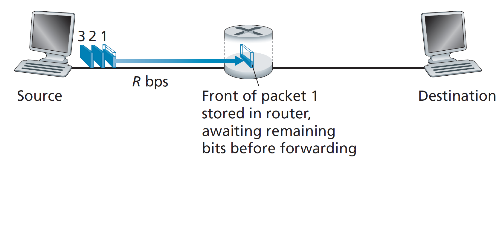

#### Packet-switching: store-and-foard

Até agora, falamos sobre as pontas da internet. Agora vamos falar sobre o seu núcleo.

O conceito fundamental para o entendimento da internet é o de rede de redes. 

#### Internet: a rede das redes

A fim de facilitar o uso e trazer mais informações para os usuários, os dispositivos, atualmente, 
Atualmente, é cada vez mais comum encontramos dispositivos, como impressoras e celulares, que são capazes de interconectar-se, os quais formam uma rede de comunicação chamada LAN (*Local Area Network*), como nas residências e empresas.

Essas redes são interconectadas através das ISP's (Internet Service Provider) municipais, também chamadas de *access ISP's*, formando uma rede chamara de MAN (*Metropolitan Area Network*), que, por sua vez, são vinculadas à ISP's regionais e nacionais, ou *tier 1 ISP's*, gerando a WAN (*Wide Area Network*). Por fim, a internet vem da conexão entre as essas ISP's com as de outras regiões e nações, que podem ocorrer diretamente ou a partir do IXP *Internet Exchange Point*. É importante ressaltar que, em cima dessa estrutura mencionada, existe também os *content-provider networks* (ou redes de provedores de conteúdo), como o google, no qual interconecta-se, externamente, com os IXP's e, internamente, com uma rede privada inacessível ao público. A Figura 1 mostra, de uma forma gráfica, a rede de redes.

*Figura 1: Rede de redes*

*Produzido pelo autor*

De forma simplificada, a rede LAN tem a mesma estrutura das demais, contendo o modem, responsável por conectar diferentes redes, o roteador, o qual gerencia a rota de tráfego dos dados, e o switch, que interconecta diversos dispositivos na mesma rede. É importante dizer que essas funcionalidades podem estar contidas em um ou mais dispositivos.

#### Transmissão

A transmissão dos dados entre os dispositivos é feito através de 5 camadas, iniciando-se a partir da camada de aplicação, que ocorre no *user space*, local de origem da mensagem (enviado em pedaços de dados intulado de *packets*, ou pacotes), passando por transporte, rede (com ambas estando no *kernel space*), enlace (com uma parte do software no *kernel space* e parte em *hardware*) e física (encontrada somente em *hardware*), no qual cada uma encapsula os dados das camadas anteriores e adiciona o seu *header*, tendo como saída, respectivamente, os chamados *segment*, *datagram*, *frame* e a série de sinais físicos que representam os *bits*.
As duas últimas camadas, enlace e física, são implementadas pela NIC (*Network Interface Card*, ou placa de rede).

O receptor desses dados fará o processo inverso, extraindo o *header* de sua respectiva camada de forma a desencapsular a informação, até que a mensagem seja entregue para a aplicação receptora, como mostrado na Figura 2.

*Figura 2: Emissor e receptor dos dados*

*Produzido pelo autor*

É interessante perceber que essa arquiterura de protocolos empilhados torna cada camada uma provedora de serviços à camada superior, algo que torna o sistema modular, fácil de ser atualizado e fácil de ser debatido e explicado. Porém, esses sistema de camadas pode conter duplicações de funcionalidade e de informação.

Normalmente a transmissão não ocorre de um modo direto entre o emissor e o receptor, e sim aliado também aos dispositivos já mencionados anteriormente, como o *switch*. Esses aparelhos utilizam de algumas camadas para a sua operação, como a de rede, enlaço e física para o roteador, procedendo com o desencapsulamento dos dados recebidas e o encapsulamento com o seu protocolo, para assim repassá-las para frente.

#### Repasse.

O repasse dos dados é feita utilizando a técnica *store and fowarding*, no qual cada pacote "pula" de um dispositivo para o outro, sendo primeiro armazenado (store) e em seguida repassado (fowarding). Assim a transmissão entre o computador A e o B contendo um roteador como intermediário ocorrerá da seguinte forma:

  1. A mensagem é gerada pela aplicação do emissor
  2. A mesma é separada em pacotes, e esses vão passar por todas as 5 camadas, recebendo um *header* de cada uma.
  3. O *frame* (dados gerados pela camada de enlace), será enviado bit a bit para o intermediário.
  4. O intermediário salva (*store*) os bits recebidos até completar o *frame*.
  5. O *frame* é repassado (*fowarding*) para o computador B.
  6. Em paralelo ao envio, o roteador recebe os dados do *frame* seguinte.
  7. O computador B desemcapsula o *frame* recebido e armazena o pacote.
  8. Esse processo se repete até que todos os pacotes sejam recebidos e utilizados para remontar a mensagem.

Ao ser transmitido, a mensagem demora (*transmission delay*), para sair do computador B até o roteador, L/R, no qual L é o tamanho do pacote em bits e R é a velocidade de transmissão em bits/segundo. Considerando que o *transmission delay* é igual entre o computador A e B e o roteador, o atraso total na transmissão será de 2*L/R. Similarmente, 3*L/R para 2 pacotes (pois a operação de recebimento e envio do dispositivo intermediário ocorre em simultâneo) e 4*L/R para 3 pacotes. Assim, o atraso total na transmissão pode ser dado por: 
      
      transmission delay = (n + 1) * L/R
      
Sendo N o número total de pacotes que deve ser transmitido.
A Figura 3 mostra, graficamente, esse processo.

*Figura 3: Store and Fowarding*

*Imagem retirada de: Computer Networking a top-down approach. 8th ed. Pearson. Página 24*

Considerando L = 10 kbits e R = 100 Mbps, então L/P = 0.1 milisegundos.

É importante perceber que, por consequência do limite de memória RAM, pode ocorrer uma insuficiência de espaço para o armazenamento e enfileiramento dos dados para transmissão. Além disso, o padrão *store-fowarding* tras consigo todos os problemas inerentes da arquitetura produtor-consumidor (por causa de sua equivalência). Assim, pacotes podem ser ignorados caso a memória RAM seja utilizado em sua totalidade (algo que envolve outros conceitos como qualidade de serviço e prioridade de transmissão).

Em casos reais, o cálculo do atraso total deve levar em conta, além do *transmission delay* (que está relacionado com o tempo necessário para o dispositivo enviar os dados), outros tipos de atraso como no processamento, atraso de enfileiramento e de propagação (que está relacionado com o atraso na propagação do bit através do meio de transmissão, impactado, portanto, pela distância, sendo calculado pela divisão entre a distância e a velocidade de propagação).

##### Analogia com uma caravana

O processo mencionado anteriormente pode ser entendido como uma analogia a uma caravana de carros.
Imagine uma caravana (pacote) de 10 carros (bits) que pecorrem (propagam) em uma velocidade de 100 km/h, com cada carro gastando 12 segundos (tempo de transmissão) com o serviço do pedágio (roteador). O próximo pedágio está a uma distância de 100 km. Assim, o tempo total de pecorrer do primeiro pedágio até a chegada ao segundo vai ser a soma do tempo da caravana ser processada pelo primeiro pedágio (12 segundos / carro * 10 carros = 2 minutos) mais o tempo necessário para pecorrer a pista (100km / 100km/h = 60 minutos), algo que resulta em 62 minutos.

#### Roteador
Os roteadores são computadores de propósito específico, sendo otimizados para operar as camadas de rede, enlace e física (a primeira em destaque). Executam programas para configurações, com sua página HTML enviando comandos ao shell do Linux (sistema operacional normalmente encontrado nesses dispositivos). São responsáveis por mover os pacotes de entrada para a sua saída apropriada. Para tal, é utilizado uma tabela de encaminhamento, no qual, a determinação do *link* que a mensagem deve ser transmitida é feita a partir do *IP address* (endereço do computador no procolo de internet), que está localizado no *header* adicionado pela camada *network*. Nos sistemas mais antigos, o algoritmo de roteamento estava contido no roteador, porém, com o aumento da complexidade das redes, esse algoritmo foi desacoplado do roteador, passando para um servidor que atualiza a tabela de encaminhamento (que pode ser entendida como uma configuração da rede), sistema chamado de *software define networks*.
Essa configuração de rede ocorre no *core* da rede, e não nas bordas, pois, por exemplo, em redes domésticas, só há uma única saída.
