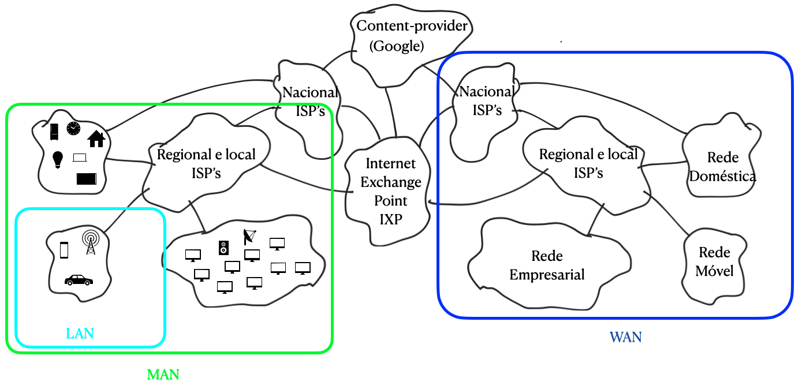

#### Packet-switching: srote-and-foard

Até agora, falamos sobre as pontas da internet. Agora vamos falar sobre o seu núcleo.

O conceito fundamental para o entendimento da internet é o de rede de redes. 

#### Internet: a rede das redes

A fim de facilitar o uso e trazer mais informações para os usuários, os dispositivos, atualmente, 
Atualmente, é cada vez mais comum encontramos dispositivos, como impressoras e celulares, que são capazes de interconectar-se, os quais formam uma rede de comunicação chamada LAN (*Local Area Network*), como nas residências e empresas.

Essas redes são interconectadas através das ISP's (Internet Service Provider) municipais, também chamadas de *access ISP's*, formando uma rede chamara de MAN (*Metropolitan Area Network*), que, por sua vez, são vinculadas à ISP's regionais e nacionais, ou *tier 1 ISP's*, gerando a WAN (*Wide Area Network*). Por fim, a internet vem da conexão entre as essas ISP's com as de outras regiões e nações, que podem ocorrer diretamente ou a partir do IXP *Internet Exchange Point*. É importante ressaltar que, em cima dessa estrutura mencionada, existe também os *content-provider networks* (ou redes de provedores de conteúdo), como o google, no qual interconecta-se, externamente, com os IXP's e, internamente, com uma rede privada inacessível ao público. A Figura 1 mostra, de uma forma gráfica, a rede de redes.

*Figura 1: Rede de redes*

*Produzido pelo autor*

De forma simplificada, a rede LAN tem a mesma estrutura das demais, contendo o modem, responsável por conectar diferentes redes, o roteador, o qual gerencia a rota de tráfego dos dados, e o switch, que interconecta diversos dispositivos na mesma rede. É importante dizer que essas funcionalidades podem estar contidas em um ou mais dispositivos.

#### Transmissão

A transmissão dos dados entre os dispositivos é feito através de 5 camadas, iniciando-se a partir da camada de aplicação, local de origem da mensagem (enviado em pedaços de dados intulado de *packets*, ou pacotes), passando por transporte, rede, enlace e física, no qual cada uma encapsula os dados das camadas anteriores e adiciona o seu *header*, tendo como saída, respectivamente, os chamados *segment*, *datagram*, *frame* e a série de sinais físicos que representam os *bits*.

O receptor desses dados fará o processo inverso, extraindo o *header* de sua respectiva camada de forma a desencapsular a informação, até que a mensagem seja entregue para a aplicação receptora, como mostrado na Figura 2.

*Figura 2: Emissor e receptor dos dados*

*Produzido pelo autor*

É interessante perceber que essa arquiterura de protocolos empilhados torna cada camada uma provedora de serviços à camada superior, algo que torna o sistema modular, fácil de ser atualizado e fácil de ser debatido e explicado. Porém, esses sistema de camadas pode conter duplicações de funcionalidade e de informação.

Normalmente a transmissão não ocorre de um modo direto entre o emissor e o receptor, e sim aliado também aos dispositivos já mencionados anteriormente, como o *switch*. Esses aparelhos utilizam de algumas camadas para a sua operação, como a de rede, enlaço e física para o roteador, procedendo com o desencapsulamento dos dados recebidas e o encapsulamento com o seu protocolo, para assim repassá-las para frente.

### Repasse.

O repasse dos dados é feita utilizando a técnica *store and fowarding*.

